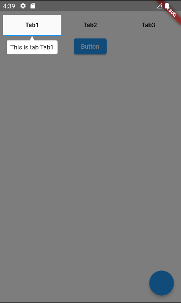

## Flutter User Guildance
Provide the user guildance widget to make developers easy to make new user tips.

## Screen
|  |  |
| :-----:| :----: |
|  |  |

## UserGuildanceAnchor
The widget is used to mark what widget need highlight. Using the widget wrap the item which you want to highlight
| Property | Usage |
| :-----| :---- |
| group | You can specify which group will be show in the user guildance. |
| step | The step which show in group. |
| subStep | If the step is same, subStep will be determine the show order. |
| tag | The tag will pass to tipBuilder and slotBuilder. If the end user is not provide tipBuilder, the tag will be used as tip string. |
| reportType | null: Just highlight itself, tab: It will find parent tab node to highlight it. |
| adjustRect | If the hight rect is not accurate or not you want. The method will allow you to adjust the highlight rect. |

## UserGuildance
The wiget is used to show highlight items. It make sure the widget show in full screen.
| Property | Usage |
| :-----| :---- |
| controller | The controller is used to show, hide and move next step. |
| tipBuilder | Provide custom tip widget. |
| slotBuilder | Provide custom slot effect. |
| opacity | The mask's opacity |
| duration | The animiation time in two step. |

## UserGuidanceController
The controller is used to show, hide and move next step.
| Property | Usage |
| :-----| :---- |
| show | Begin show the user guildance. You can specify group to determine which group guildance you want to show up |
| next | Move next step. You must invoke show before |
| hide | End the user guildance |
| opacity | The mask's opacity |
| duration | The animiation time in two step. |

## TipWidget
The widget is default wighet which is used in UserGuildance. You can customize it to implement the difference style. It just wrap BubbleWidget.
| Property | Usage |
| :-----| :---- |
| data | it is AnchorData. which provide in tipBuilder. It was used to calculate the arrow position. If you want specify your arrow position. You can use BubbleWidget |
| arrowWidth | Arrow width |
| arrowHeight | Arrow height |
| radius | The tip border radius |
| bkColor | The tip widget background color. |

## BubbleWidget
The widget provide basic tip functionality
| Property | Usage |
| :-----| :---- |
| direction | Which side the arrow should be show in |
| arrowWidth | Arrow width |
| arrowHeight | Arrow height |
| arrowPosition | Arrow position based on arrowPositionBased |
| arrowPositionBased | How calculate the arrowPosition based on. For example: start - If direction is top and bottom, The arrowPosition should be based on the left. |
| radius | The tip border radius |
| bkColor | The tip widget background color. |

## Simple Example
```dart
class _SimplePageState extends State<SimplePage> {
  UserGuidanceController userGuidanceController = UserGuidanceController();

  @override
  Widget build(BuildContext context) {
    return UserGuidance(
      controller: userGuidanceController,
      opacity: 0.5,
      child: Scaffold(
        floatingActionButton: UserGuildanceAnchor(
            step: 1,
            tag: "This is tab Floating button.",
            child: FloatingActionButton(
              onPressed: () {
                userGuidanceController.show();
              },
            )),
        body: SafeArea(
          child: Padding(
            padding: const EdgeInsets.all(40.0),
            child: UserGuildanceAnchor(
              step: 2,
              tag: "Start press the button",
              child:
                  ElevatedButton(onPressed: () {}, child: const Text("Button")),
            ),
          ),
        ),
      ),
    );
  }

  @override
  void dispose() {
    userGuidanceController.dispose();
    super.dispose();
  }
}
```

## Complex Example
```dart
import 'package:flutter/material.dart';
import 'package:flutter_user_guildance/flutter_user_guildance.dart';

class HomePage extends StatefulWidget {
  const HomePage({Key? key, required this.title}) : super(key: key);
  final String title;

  @override
  State<HomePage> createState() => _HomePageState();
}

class _HomePageState extends State<HomePage> {
  UserGuidanceController userGuidanceController = UserGuidanceController();
  var tabs = ["Tab1", "Tab2", "Tab3"];

  @override
  void dispose() {
    userGuidanceController.dispose();
    super.dispose();
  }

  @override
  Widget build(BuildContext context) {
    return UserGuidance(
      controller: userGuidanceController,
      opacity: 0.5,
      slotBuilder: (context, data) {
        if (data?.step == 1) {
          return BoxDecoration(
            color: Colors.white,
            borderRadius: BorderRadius.circular(data!.position.height / 2.0),
          );
        }
        return null;
      },
      tipBuilder: (context, data) {
        if (data != null) {
          return TipWidget(
            child: ConstrainedBox(
                constraints: const BoxConstraints(maxWidth: 250.0),
                child: Text("${data.tag}")),
            data: data,
          );
        }

        return null;
      },
      child: DefaultTabController(
          length: tabs.length,
          child: Scaffold(
            floatingActionButton: UserGuildanceAnchor(
                group: 1,
                step: 1,
                tag:
                    "This is tab Floating button. Click it to open new page. It should be friendly to the end user",
                child: FloatingActionButton(
                  onPressed: () {
                    userGuidanceController.show();
                  },
                )),
            body: SafeArea(
              child: Padding(
                padding: const EdgeInsets.all(8.0),
                child: Column(children: [
                  TabBar(
                      tabs: tabs.map<Widget>((txt) {
                    var subStep = tabs.indexOf(txt);
                    return Tab(
                        child: UserGuildanceAnchor(
                            step: 0,
                            subStep: subStep,
                            reportType: AnchorReportParentType.tab,
                            tag: "This is tab $txt",
                            child: Text(
                              txt,
                              style: const TextStyle(color: Colors.black),
                            )));
                  }).toList()),
                  UserGuildanceAnchor(
                    group: 1,
                    step: 2,
                    tag: "Start press the button",
                    adjustRect: (rect) {
                      return Rect.fromLTWH(rect.left, rect.top + 5.0,
                          rect.width, rect.height - 10.0);
                    },
                    child: ElevatedButton(
                        onPressed: () {
                          userGuidanceController.show(group: 1);
                        },
                        child: const Text("Button")),
                  ),
                  Expanded(
                      child: TabBarView(
                    children: tabs.map<Widget>((txt) => Container()).toList(),
                  ))
                ]),
              ),
            ),
          )),
    );
  }
}
```
